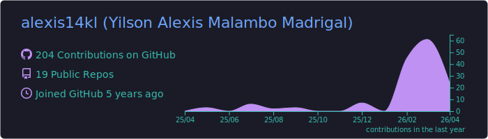
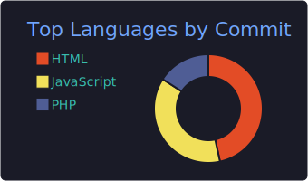
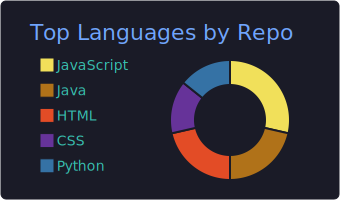
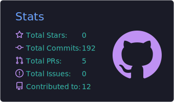
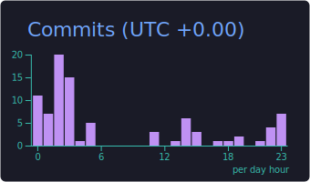

  

<h1 align="center">¡Hola! 👋 Soy Yilson Alexis Malambo Madrigal</h1>
<h3 align="center">Ingeniero en Sistemas · Desarrollador Web Full Stack</h3>

  

  
  
  

---

### 🚀 Sobre mí

- 🎓 **Ingeniero en Sistemas** graduado de la CUN
- 💼 Desarrollo aplicaciones web con **Angular**, **Laravel**, **PHP / CodeIgniter** y **MySQL**
- 🌱 Aprendiendo continuamente sobre arquitectura de software, buenas prácticas y nuevas tecnologías
- 💡 Disfruto transformar ideas y diseños en productos digitales funcionales y escalables
- 🤝 Disponible para proyectos **freelance** — pequeñas empresas y emprendedores
- 🌐 Portafolio: **[alexis-madrigal.com](https://alexis-madrigal.com)**
- 📫 Contacto: **yilson.malambo@cun.edu.co**

---

### 🛠️ Stack Tecnológico

**Frontend**

**Backend**

**Bases de datos**

**Mobile**

**Herramientas**

**Asistentes de IA**

---

### 📊 Estadísticas de GitHub

  

  
  

  
  

---

### 🐍 Mi grid de contribuciones

  

---

### 📈 Métricas detalladas

  

---

### ⚡ Actividad reciente

<!--START_SECTION:activity-->
1. 🎉 Merged PR [#2](https://github.com/alexis14kl/browser-ipc-cdp/pull/2) in [alexis14kl/browser-ipc-cdp](https://github.com/alexis14kl/browser-ipc-cdp)
<!--END_SECTION:activity-->

---

### 🌐 Conecta conmigo

  
  
  
  

---

  💡 <i>"La programación no se trata de escribir código, se trata de resolver problemas."</i>

